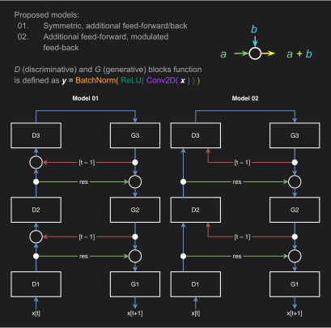

# Network architectures

Three main architectures are currently available:

 - [`PrednetModel.py`](PrednetModel.py): implementation of [*PredNet*](https://coxlab.github.io/prednet/) in *PyTorch* through the following smaller blocks:
   - [`DiscriminativeCell.py`](DiscriminativeCell.py): computes the error between the input and state projections;
   - [`GenerativeCell.py`](GenerativeCell.py): computes the new state given error, top down state, and current state. Uses the following custom module:
     - [`ConvLSTMCell.py`](ConvLSTMCell.py): a pretty standard LSTM that uses convolutions instead of FC layers;
 - [`Model01.py`](Model01.py): symmetric, additional feed-forward/back;
 - [`Model02.py`](Model02.py): AKA *CortexNet*, additional feed-forward, modulated feed-back. May use:
   - [`RG.py`](RG.py): recurrent generative block ⇒ *Model02G*.
 
 